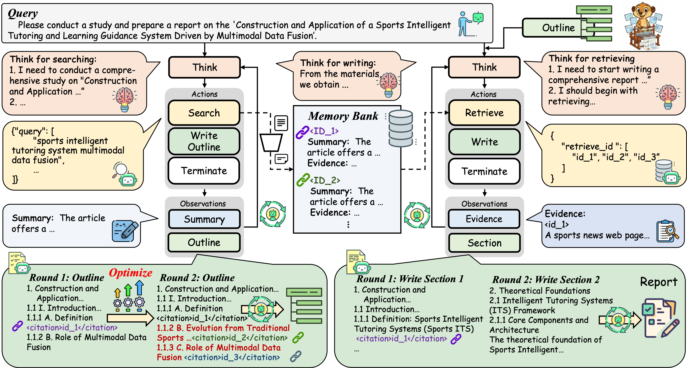

## WebWeaver: Structuring Web-Scale Evidence with Dynamic Outlines for Open-Ended Deep Research

Performance of varying deep research agents on DeepResearch Bench, DeepConsult, and DeepResearchGym. The results on DeepResearch Bench are taken from the official leaderboard. WebWeaver achieves state-of-the-art performance.

## 🎓Features

🤝🤖 **Human-Centric Dual-Agent Framework**: We introduce WebWeaver, a novel dual-agent framework that operationalizes the organic process of human research. By dividing labor between a planner (for exploration and outlining) and a writer (for synthesis), our system abandons rigid pipelines in favor of a more flexible and effective methodology.

🔄📚 **Dynamic Outline Optimization**: A core innovation is the agent's ability to treat the research outline as a "living document." Unlike static approaches, the planner operates in a continuous loop, interleaving web searches with outline refinement. This allows the research direction to evolve dynamically based on new discoveries, preventing "fossilization" and enabling genuine exploration.

🗂️🎯 **Memory-Grounded Hierarchical Synthesis**: To overcome the critical challenges of long-context limitations and "loss in the middle," the writer agent constructs the report section-by-section. For each part, it performs targeted retrieval from a curated memory bank, using only the most pertinent, pre-cited evidence. This ensures the final report is coherent, accurate, and deeply grounded in its sources.

🏆 **State-of-the-Art Performance on OEDR**: WebWeaver sets a new state-of-the-art by significantly outperforming existing proprietary and open-source agents on three challenging open-ended deep research benchmarks. This empirically validates that our human-inspired approach is more effective for tackling complex, open-ended knowledge work.

🌐🧠 **Democratizing Expertise with WebWeaver-3k**: To broaden the impact of our work, we create WebWeaver-3k, a high-quality supervised fine-tuning (SFT) dataset. Our experiments show that this dataset can distill the complex skills of our framework into smaller, more accessible models, enabling them to achieve expert-level research capabilities previously limited to large, proprietary systems.

## Performance Highlights

1. Detailed Performance of agents on DeepResearch Bench in terms of comprehensiveness (Comp.), insight, instruction-following (Inst.), readability (Read.), effective citations (Eff. c.), and citation accuracy (C. acc.). WebWeaver outperforms all other agent systems on most of the metrics.

  

2. WebWeaver-3k enables a small model to achieve expert-level performance. 

  

## 📑 Citation

If this work is helpful, please kindly cite as: